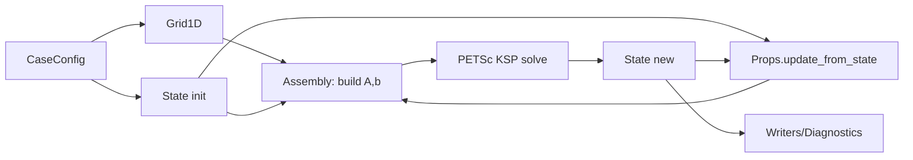

下面是新项目的**整体框架**、**可迁移模块清单**、以及**计算流程/数据流动的流程图**（含 Mermaid 流程图，直接贴到 md 里就能看）。

---

## 新项目总体结构目标

新项目的核心目标只有一个：

> 把“无化学源项的传输 + 界面 + 半径演化”写成可组装的线性系统 `A x = b`，交给 petsc4py 的 KSP 解。
> 外层再用（可选）Strang 拆分挂化学半步更新。

所以代码应该围绕 3 个核心对象组织：

* **Grid**：几何与离散（r、V、A、face/cell 映射、界面位置）
* **State**：未知量（Tg/Yg/Tl/Yl + Ts/m''/Rd）与派生量
* **Props**：物性/传输系数（ρ、cp、λ、D、h…），由 State 驱动更新

以及 2 个关键动作：

* `assemble(A,b)`：从 Grid+Props+State_old + dt 组装线性系统
* `solve(A,b)`：PETSc 解 `x`，再解包回 State_new

---

## 推荐的项目目录与模块职责

建议直接这样开新仓库（名字随便，但结构别随便）：

```
droplet2/
  run.py
  cases/                       # 多工况输入
    case_001.yaml
  config/
    schema.md                  # 配置说明（强烈建议）
  core/
    types.py                   # dataclass：State/Grid/Props/CaseConfig
    layout.py                  # UnknownLayout：全局向量下标映射
    grid.py                    # Grid1D：网格/几何/界面定位/动网格接口（先静网格）
    state.py                   # State：字段存储、pack/unpack、守恒约束检查
  physics/
    flux_gas.py                # 气相对流/扩散通量离散（不含化学）
    flux_liq.py                # 液相扩散/导热离散
    stefan_velocity.py         # v(r)=m'' Rd^2/(ρ r^2) 及 face 上速度
    interface_bc.py            # Cuoci风格界面条件：Yg_s, J, 能量跳跃
    radius_eq.py               # Rd 演化残差/方程（与 m'' 耦合）
  properties/
    gas.py                     # Cantera：ρ_g, cp, λ, D_k, h_k/h_mix
    liquid.py                  # CoolProp：ρ_l, cp, λ, hvap, psat
    equilibrium.py             # Raoult + psat + 背景气填充，输出 Yg_s
  assembly/
    build_system.py            # build_transport_system_petsc(): A,b
    bc_outer.py                # 远场边界：Dirichlet/Neumann/混合
    bc_center.py               # r=0 对称边界（通量为 0）
  solvers/
    petsc_ksp.py               # KSP/PC 配置与求解封装
    timestepper.py             # 时间推进：隐式传输步 +（可选）化学拆分
    chemistry.py               # （可选）Cantera cell ODE 半步更新（后续接入）
  parallel/
    case_mpi.py                # mpi4py：多 case 分发（rank->case）
    kernels.py                 # 物性/化学并行 kernels（joblib/numba/mpi）
  io/
    log.py                     # 日志
    writers.py                 # 输出：csv/npz/vtk（你现在那套输出逻辑可迁移）
    checkpoints.py             # 断点续算
  tests/
    test_layout.py
    test_pack_unpack.py
    test_scalar_diffusion.py
    test_interface_balance.py
    test_mass_conservation.py
```

你会发现：**旧项目里最容易炸的 “residuals/assembly/newton” 被拆散了**。这是故意的。新项目不该再有那种“一个函数干一切”的模块。

---

## 现有代码哪些能迁移，哪些要丢（很重要）

### 可以直接迁移/小改就能用的模块

1. **配置体系**

   * `sim_config.yaml`、`SimulationParameters` 这套：✅ 保留
   * 但建议把“牛顿遗留参数”清理掉，改成：

     * 网格参数、物性模型选项、边界条件、KSP/PC 参数、输出开关

2. **初始化与网格工具**

   * 你现有的 `initial.py` / `geometry`：✅ 大部分可迁移
   * 但需要输出统一的 `Grid1D`（包含 V/A/face/cell 映射）

3. **物性计算**

   * 气相 Cantera 物性：✅ 迁移（封装成 `properties/gas.py`）
   * 液相 CoolProp：✅ 迁移（封装成 `properties/liquid.py`）
   * 注意：把“计算结果写回 grid/data 的散乱方式”改成写入 `Props` 对象

4. **界面热力学（psat、Raoult、背景气填充）**

   * 你已经做过 “Raoult + CoolProp psat + 背景气填充”那套：✅ 迁移
   * 但是放进 `properties/equilibrium.py`，不要散在 interface 里

5. **输出与日志**

   * 你那套 `export_custom_spatial_data` 思路：✅ 迁移
   * 只是新项目数据结构变了，要改字段名和路径组织

### 需要重写的核心模块（别心存侥幸）

1. **Residuals_assembly / assembly（旧）**

   * 旧：拼残差 -> 牛顿/数值雅各比 -> 解线性
   * 新：直接拼矩阵 `A` 和右端 `b`
     ✅ 必须重写（放到 `assembly/build_system.py`）

2. **DirectNewton / GMRES / JFNK / solver_data（旧）**

   * 这套在新框架里基本没必要存在
     ✅ 改为：`solvers/petsc_ksp.py` + 少量 debug 信息记录

3. **旧的 pack/unpack**

   * 你之前已经被 pack/unpack 坑到怀疑人生
     ✅ 必须重写成 `UnknownLayout` 驱动的 pack/unpack（别再到处手写 index）

---

## “写成什么样子”才能接入 petsc4py

PETSc 要的就是两样东西：`Mat A` 和 `Vec b`。

所以你要提供一个标准接口：

```python
A, b, layout = build_transport_system_petsc(grid, props, state_old, dt, comm)
```

约束很明确：

* `layout.size()` 给出全局未知量长度 N
* `A`：`PETSc.Mat().createAIJ([N,N])`，通过 `setValue(row, col, val, addv=True)` 填系数
* `b`：`PETSc.Vec().createMPI(N)`，通过 `setValue(row, val, addv=True)` 填右端
* `layout`：提供每个未知量的全局索引（Tg/Yg/Tl/Yl/Ts/m''/Rd）

然后求解只需要：

```python
ksp.setOperators(A)
ksp.solve(b, x)
unpack_vec_to_state(x, layout, state_new)
```

只要你能稳定产出 `A,b`，PETSc 就能工作。

---

## 计算流程与数据流动流程图

### 1）计算流程（时间推进 + 并行层次）

```mermaid
flowchart TD
  A[读取 case 配置\n(case.yaml + 机理 + 输出选项)] --> B[初始化 Grid1D\n(几何/体积/面积/界面索引)]
  B --> C[初始化 State^n\n(Tg,Yg,Tl,Yl,Ts,m'',Rd)]
  C --> D[更新 Props\n(Cantera+CoolProp 计算 ρ,cp,λ,D,h,psat...)]
  D --> E[组装线性系统 A,b\nbuild_transport_system_petsc]
  E --> F[PETSc KSP 求解\nA x = b]
  F --> G[解包 x -> State^{n+1}\n(pack/unpack via Layout)]
  G --> H[派生量更新\nv(r), face 通量诊断, 约束检查]
  H --> I{输出/自适应 dt?}
  I -->|写输出| J[IO: csv/npz/图/日志]
  I -->|继续| D

  subgraph Parallel
    P1[mpi4py: 多 case 分发\nrank->case] --> A
    P2[case 内并行: \n物性/化学 kernels] --> D
    P3[PETSc: KSP 并行求解\n(可选)] --> F
  end
```

说明一下数据流的“主循环”：

* `State` 驱动 `Props.update_from_state(state)`
* `Grid + Props + State_old + dt` 驱动 `assemble(A,b)`
* `PETSc` 只负责从 `A,b` 得到 `x`
* `x` 再更新回 `State_new`

### 2）数据对象流动（谁依赖谁）



关键点：**禁止反向依赖**。
不要让 `properties` 去 import `assembly`，不要让 `grid` 去 import `solver`。模块一旦互相咬住，你会得到一个只能靠祈祷运行的项目。

---

## 最终“新项目整体了解”的一句话版本

* `core` 负责：网格、状态、未知量布局（pack/unpack）
* `properties` 负责：给定 state 算物性（可并行）
* `physics` 负责：通量公式、界面条件、Stefan 速度、半径方程
* `assembly` 负责：把物理离散成 `A,b`
* `solvers` 负责：调用 PETSc KSP 解、时间推进（以后再接化学拆分）
* `parallel` 负责：多 case 分发 + case 内 kernels 并行
* `io` 负责：输出与断点

你现在只要按这个结构重构，哪怕你后面再加动网格、再加化学拆分、再加更复杂的预条件器，都不会把项目再变回一团“改无可改”的糊状物。


---

## 总原则：先立法，再施工，再通车

* **立法层**：`types / layout / grid / cfg`
  这些先定死：字段名、shape、接口、单位、符号约定
* **施工层**：`properties / physics / bc`
  在立法层约束下实现物性、通量、边界、界面系数
* **通车层**：`assembly(A,b) / petsc solve / timestepper`
  让 PETSc 真正跑起来
* **验收层**：`tests / diagnostics / io`
  先用最简单 PDE 证明系统能收敛，再逐步加复杂物理


---

# 分步工作计划（按依赖顺序）

## Step 0：仓库骨架与“不可违反的规范”

**目标**：创建新项目目录结构 + 统一规范，不写任何物理细节
**产出**：

* 目录结构按 `NewProject_Guide_NoChem_PETSc.md` 建好
* `cases/case_001.yaml` 最小配置（物种列表、边界、网格、dt、求解器选项）
* `README.md` 写死三条：

  1. 索引只从 `UnknownLayout` 来
  2. 物性只在 `Props`
  3. 组装只写 `A,b` 不改 `State`

---

## Step 1：core/types.py（立法：字段/shape/单位/命名）

**依赖**：无
**目标**：定义 `CaseConfig / Grid1D / State / Props / Diagnostics` dataclass
**产出**：

* 字段名、shape 明确：

  * `Tg[N_g]`, `Yg[Nspec_g, N_g]`（或 eff 版本）
  * `Tl[N_l]`, `Yl[...]`
  * `Ts, m_evap, Rd`
* 最基本合法性检查函数：

  * `check_sumY(state)`
  * `check_nonneg(state)`
  * `check_positive_props(props)`
* **迁移动作**：从旧 `data.py` 抄“字段清单”，但别抄“写回逻辑”

---

## Step 2：core/layout.py（立法：全局向量索引 + pack/unpack）

**依赖**：types
**目标**：UnknownLayout 定死索引和闭合策略
**产出**：

* `UnknownLayout.size()` + 各 `idx_*()`
* `pack(state)->Vec`，`unpack(vec)->state`
* **关键规范在此敲死**：

  * 用哪个闭合物种（比如 N2）
  * ΣY 如何处理（eff vs 全量+约束行）
* 单测：

  * `test_pack_unpack`: pack→unpack 不乱，误差为 0

> 这一步不完成，后面任何 assembly 都是白搭。

---

## Step 3：core/grid.py（立法：几何/离散模板）

**依赖**：types
**目标**：建立可靠的球坐标 FVM 几何：`r_cell/r_face/V/A`
**产出**：

* `Grid1D` 生成函数（气相/液相两域）
* 界面索引与相邻 cell：

  * `iface`, `i_g0`, `i_l_last` 之类
* 单测：

  * 体积/面积数量级合理
  * 中心边界 face 的面积为 0 或通量处理正确（取你实现方式）

**迁移动作**：旧 `geometry.py` 的网格/体积面积算法迁移到这里（删掉跟 data 写回绑定的部分）

---

## Step 4：properties/equilibrium.py（立法：界面平衡输出格式）

**依赖**：types
**目标**：界面平衡逻辑输出结构先定死，后面 interface_bc 才能按这个写
**产出**：

* 函数签名固定：

  ```python
  Yg_s, extra = compute_interface_gas_state(state, props, cfg)
  ```
* 规定背景气填充策略字段名（cfg 里写死）
* 返回 `extra` 至少包含：

  * `psat_i`, `x_liq`, `x_gas`, `Mw_mix` 等（便于诊断）

> 这一步先把“接口”定出来，内部可以先写简化版（单组分 + 远场填充）。

---

## Step 5：properties/gas.py + properties/liquid.py（物性实现，先跑通再变复杂）

**依赖**：types, grid, equilibrium(可选)
**目标**：实现 `Props.update_from_state(state, grid, cfg)`
**产出**：

* 最小可用字段：

  * 气相：`rho_g, cp_g, lam_g`（D 可先占位）
  * 液相：`rho_l, cp_l, lam_l, hvap, psat`
* 单测：

  * 对任意合理 state，不出现 NaN/负值
  * 分子量来源可靠（避免旧项目那种“摩尔质量没算就用”）

**迁移动作**：把旧物性模块迁移，但把“写回 data 的散乱路径”收敛为只写 Props

---

## Step 6：assembly 的“最小闭环”先跑：标量扩散（无界面、无对流）

**依赖**：types, layout, grid, props, petsc_ksp
**目标**：证明你能稳定拼 `A,b` 并用 PETSc 解出来
**产出**：

* `assembly/build_system.py` 先实现一个 **最小系统**：

  * 只解气相 `Tg` 扩散（v=0）
  * Dirichlet 边界（远场）、中心对称（若只气相可用内边界代替）
* `solvers/petsc_ksp.py`：

  * 创建 KSP，GMRES+ILU
* 单测：

  * `test_scalar_diffusion`：结果趋势正确、收敛稳定

> 这一步是“通车测试”。没通车前别碰界面，别碰 Y，别碰 Stefan 流。

---

## Step 7：physics/flux_gas.py（加入通用扩散/导热 stencil）

**依赖**：grid, props
**目标**：把 Step6 里写死的扩散离散抽象成可复用通量模块
**产出**：

* `gas_diffusion_stencil(i)` 返回 row 的 `(cols, vals, rhs_add)` 或类似结构
* 统一“流出为正”的符号约定

---

## Step 8：physics/stefan_velocity.py + 对流离散（先气相）

**依赖**：props, state, grid
**目标**：引入 Stefan 派生速度 v(r)，把对流项写进 A
**产出**：

* `compute_v_face(m_evap, Rd, rho_face, r_face)`
* 对流插值策略写进 cfg（upwind/central）
* 单测：

  * v(r) 数量级合理，r→∞ 衰减 ~1/r^2（在密度近似恒定时）

---

## Step 9：气相多组分 Yg（先不加界面）

**依赖**：layout, flux_gas, props, assembly
**目标**：把 `Yg` 方程加入组装（对流+扩散），但边界先用人为 Dirichlet
**产出**：

* `Yg` 的块矩阵装配
* ΣY 策略严格执行：

  * eff 变量 + 补齐闭合物种
  * 或全量变量 + 约束行（你选哪套就锁死）
* 单测：

  * ΣY=1、Y≥0 基本不炸

---

## Step 10：液相导热 Tl（仍然不加界面耦合，先做单域或固定界面温度）

**依赖**：grid, props, layout, assembly
**目标**：加入液相能量方程离散
**产出**：

* r=0 对称边界正确
* 界面侧先用 Dirichlet `Tl(Rd)=Ts_fixed` 过渡

---

## Step 11：physics/interface_bc.py + physics/radius_eq.py（加入 Ts/m''/Rd 三个标量未知量）

**依赖**：equilibrium, props, grid, layout
**目标**：把最关键的三条方程接进系统：

* 温度连续（或 ghost 方式实现）
* 界面能量跳跃
* 界面质量条件（Stefan）
* Rd 演化方程

**产出**：

* interface_bc 返回“装配系数包”，build_system 把它写进 A,b
* 单测：

  * `test_interface_balance`：m'' 正号对应蒸发、能量守恒符号链一致

---

## Step 12：整合 timestepper（单步推进 + 输出 + 失败诊断）

**依赖**：全部
**目标**：形成可跑 case 的主循环
**产出**：

* `solvers/timestepper.py`：

  * 固定 dt 跑 N 步
  * 每步做：props→assemble→solve→unpack→diagnostics→output
* `io/writers.py` 最小输出：

  * 每步保存 Tg/Yg/Tl/Ts/m''/Rd（csv/npz）

---

# 旧项目迁移优先级（按上面步骤对应）

* 立即迁移（Step1-3）：`data字段清单 / geometry 网格算法 / initial 初值逻辑`
* 中期迁移（Step5）：`Cantera + CoolProp 物性`
* 后期迁移（Step11）：`interface 里的物理公式，但必须拆到 equilibrium + interface_bc`
* 不迁移（直接扔掉）：旧 `Residuals_assembly/Newton/JFNK/search/solver_data`

---

## 最后给你一个“别乱跑偏”的验收标准

每一步做完你都要能回答：

1. 这个模块提供的**接口**是什么？（函数签名/返回值/副作用）
2. 它依赖什么对象？（Grid/State/Props/Layout 哪些）
3. 它写了谁？（只允许写自己的对象，别跨对象写）

做到这三个，你的新项目就不会再变成“面条工程”。

如果你愿意，下一步我可以把 Step1~Step3 的 `types/layout/grid` 直接给你一个最小代码骨架（不含物理），让你迁移时只填字段，不再纠结结构。
